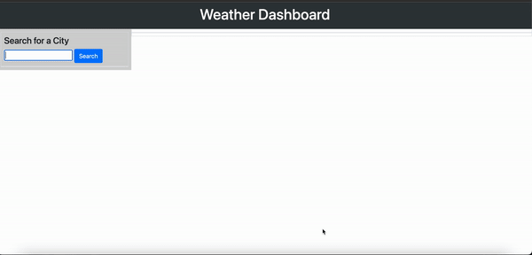

# Weather Dashboard

## Purpose
This is a web-based dashboard showing the current weather in a city of users choice and the upcoming five (5) day forecast for the selected city

Once you've entered the city of your choice and clicked on the search button you will then be given a view of the current weather, temperature, humidity, wind speed, and UV Index for that city at that current time. Upon the search, the dashboard will also display the weather, temperature and humidity forecast for the next five(5) days. 

The UV Index will be indicating by a color depending on the severity of the index. Favorable is shown as green, Moderate is shown as yellow and Severe is shown as red. 

Previous searches are saved into localStorage and the five (5) most recent searches are available as buttons in order for easy access and re-searching of weather and forecasts

## Built With
* HTML
* Javascript
* CSS
* Open Weather APIs
* Bootstrap 
* Moment.js 

## URL
https://amir-hackett.github.io/weather-dashboard/

## Mock Up

## Contribution
Amir Hackett ©2022